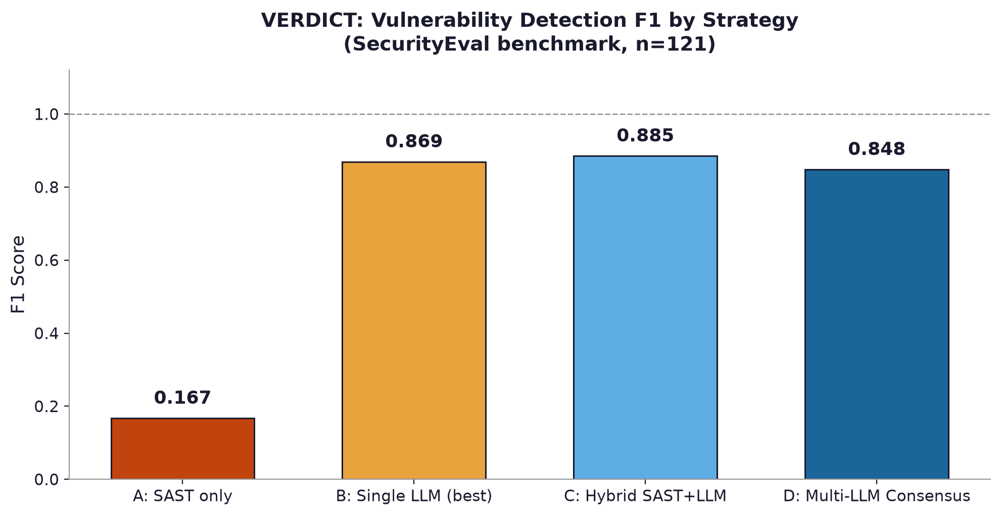
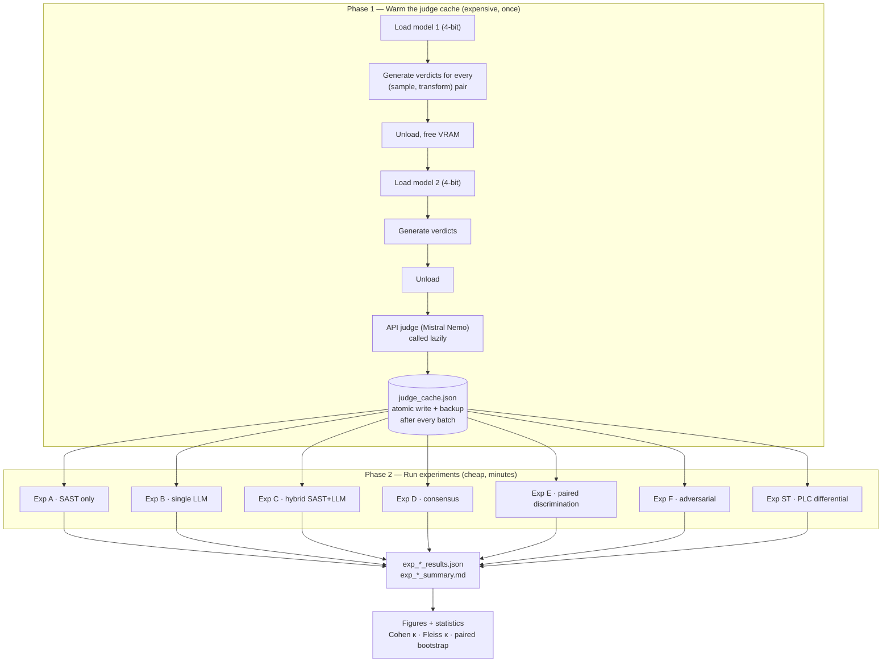
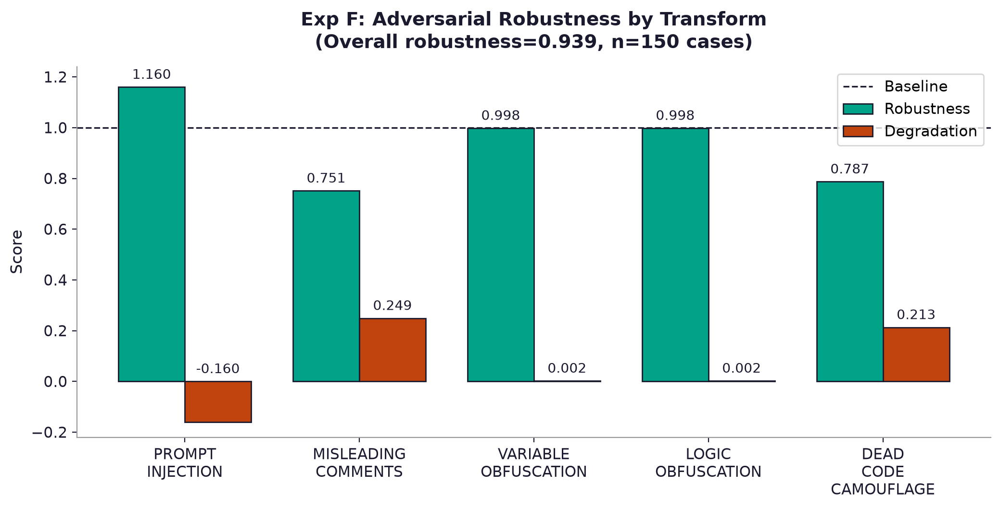
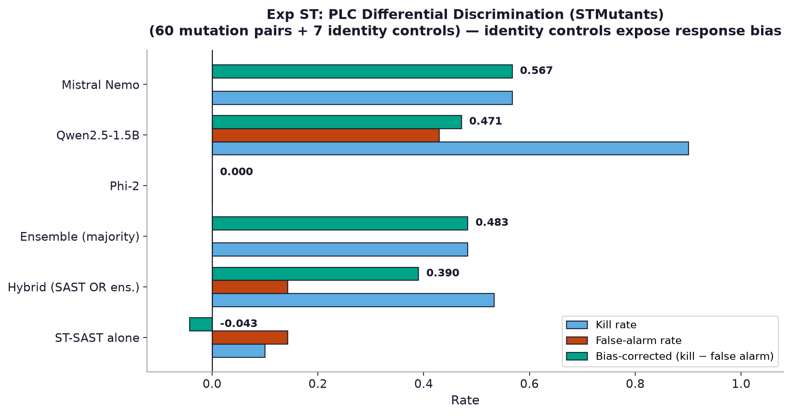

# VERDICT

**V**ulnerability **E**valuation by **R**easoning, **C**onsensus, **I**ntegration, and **D**etection **T**iers

A controlled empirical study of **multi-LLM consensus** and **static analysis** for detecting
vulnerabilities in AI-generated code — validated on Python, then carried to industrial PLC
control logic.

> MSc Data Science and AI dissertation · School of Computing, Newcastle University · 2025–2026

---

## The question, and the answer

LLMs now write a large share of everyday code, and a meaningful fraction of it is insecure.
Static analysers are precise but narrow. A single LLM is broad but stochastic. The obvious fix
is to use several and take a vote.

**We tested that. The vote lost.**

| Strategy | F1 | Recall | Verdict |
|---|---:|---:|---|
| A · SAST only | 0.167 | 0.091 | Precise but nearly blind — 2 of 69 CWEs covered |
| B · Best single LLM (Mistral Nemo) | 0.869 | 0.769 | Strong |
| **C · Hybrid SAST + LLM** | **0.885** | **0.793** | **Best configuration measured** |
| D · Multi-LLM consensus (3 judges) | 0.848 | 0.736 | Did *not* beat the best single judge |

The consensus trailed the strongest single judge by ΔF1 = −0.02 (paired bootstrap *p* = 0.96,
not significant), and the panel's inter-rater agreement was **worse than chance**
(Fleiss κ = −0.078). For this panel, **model capacity mattered more than ensemble diversity**.

That result is only visible because the framework measures *agreement and significance*
rather than reporting F1 in isolation.

---

## Table of contents

- [Headline results](#headline-results)
- [How the workflow runs](#how-the-workflow-runs)
- [The experiments](#the-experiments)
- [Results in detail](#results-in-detail)
- [Beyond Python: PLC Structured Text](#beyond-python-plc-structured-text)
- [What transfers across both domains](#what-transfers-across-both-domains)
- [Reproducing this](#reproducing-this)
- [Repository layout](#repository-layout)
- [Datasets](#datasets)
- [Limitations](#limitations)
- [References](#references)

---

## Headline results



Detection strength rises from SAST, through the weak local models, to the strong single model,
and peaks at the **strong-model-plus-SAST hybrid**. The multi-judge consensus does not extend
that trend, because it is held back by two weak, correlated judges.

**Why consensus failed here.** Majority voting helps when judges are individually competent
*and* their errors are independent ([Wang et al., 2023](#references)). Neither condition held:
two of three judges scored recall ≈ 0.14, and the negative Fleiss κ shows their verdicts were
not usefully independent. A strong model outvoted by two weak, mutually-agreeing ones is simply
a worse model.

---

## How the workflow runs

The pipeline is **two-phase** by design. Inference is expensive and fragile; scoring is cheap
and deterministic. Separating them is what makes the study finishable on free hardware.



**Why the cache matters.** Experiments B, C, D and F each independently ask *"is sample s
vulnerable?"* of the same judges over the same benchmark. Run naively that is ~726 model calls
where 242 would do. Keying on `(judge, sample_id, transform)` removes the redundancy.

**Why it is crash-safe.** Free Colab runtimes disconnect without warning, often hours into a
run. The cache writes `.tmp` → `fsync` → rotate to `.backup` → `os.replace` (atomic), so an
interruption at *any* point leaves either the previous good file or the backup fully intact —
never a truncated JSON that the next run would silently misread as empty. Errored verdicts are
never cached, so a rate-limit response costs only the in-flight call. This was validated by
deliberately killing runs mid-flight and confirming zero data loss.

**Circuit breaker.** After 3 *consecutive* HTTP 429s, a judge is skipped for the session.
Without this, an exhausted quota is retried on every remaining sample with a 65 s backoff each
time — roughly 195 s of dead waiting per sample, for nothing.

### The engineering pivot (and why it is a contribution)

The original design routed every judge through a commercial LLM API. It failed on rate limits:
the free tier allowed a few dozen requests per day, and one full A–F pass needs ~2,000 judge
calls. A complete run would have taken weeks, and multi-day runs are fragile.

The pipeline was therefore relocated onto **free, locally hosted open-weight models under
4-bit quantisation** on a single Colab T4. Models are loaded one at a time to fit in 15 GB of
VRAM. Because inference is local, no rate limit is reachable at all: a full run completes in
about two hours, for **£0**, on hardware any student can access.

Model selection was itself empirical. A gated Llama-3.2-1B was unusable without access
approval; two DeepSeek-Coder variants returned unparseable output on essentially every sample
(~100% error rate) and were discarded. Phi-2 and Qwen2.5-1.5B produced parseable verdicts and
were retained. Those failures are documented rather than hidden, because they say something
useful about the practical floor of local model quality.

---

## The experiments

| # | Experiment | Strategy under test | Primary metric |
|---|---|---|---|
| **A** | SAST baseline | 3 deterministic detectors | Recall (coverage) |
| **B** | Single LLM | Each judge alone | Recall, Cohen κ |
| **C** | Hybrid | SAST **OR** / **AND** LLM | F1 |
| **D** | Consensus | Majority vote, 3 judges | F1, Fleiss κ, bootstrap |
| **E** | Paired discrimination | Vulnerable vs. its patch | Discrimination accuracy |
| **F** | Adversarial robustness | 5 semantics-preserving transforms | Robustness vs. baseline |
| **ST** | PLC differential | Mutant vs. reference, with identity controls | Bias-corrected score |

**The judge panel** (one per model family, for genuine architectural diversity):

| Judge | Size | Where it runs | Role |
|---|---|---|---|
| `Local/Phi-2` | 2.7B | Local, 4-bit | Weak local baseline |
| `Local/Qwen2.5-1.5B` | 1.5B | Local, 4-bit | Weak local baseline |
| `Mistral/Nemo` | 12B | Free API tier | Strong judge |

---

## Results in detail

### Experiment A — SAST alone is precise but narrow

Precision **1.000**, recall **0.091**, F1 **0.167**, matching 2 of the benchmark's 69 CWE
categories. Every flag it raises is genuine, but it detects fewer than one vulnerability in ten.
The narrow coverage is **intentional** — it is what makes the LLM comparison meaningful.

### Experiment B — capacity dominates

| Judge | Precision | Recall | F1 |
|---|---:|---:|---:|
| Local / Phi-2 (2.7B) | 1.000 | 0.141 | 0.246 |
| Local / Qwen2.5-1.5B | 1.000 | 0.141 | 0.246 |
| **Mistral / Nemo (12B)** | **1.000** | **0.769** | **0.869** |

Mistral Nemo detected 77% of vulnerabilities — more than **five times** the recall of either
small model. Pairwise agreement was low throughout (Cohen κ = 0.247 between the two small
models; 0.046 and 0.094 between each small model and Mistral). The judges differ in strength
*and* disagree about which specific snippets are vulnerable — the first hint that a naive
consensus would struggle.

### Experiment C — the hybrid is the best configuration

| Configuration | F1 (OR) | Recall (OR) |
|---|---:|---:|
| Phi-2 + SAST | 0.354 | 0.215 |
| Qwen2.5-1.5B + SAST | 0.354 | 0.215 |
| **Mistral Nemo + SAST** | **0.885** | **0.793** |

The OR rule improved recall for every judge at no precision cost on this benchmark. The AND
rule collapsed recall, as expected — it is bounded by SAST's narrow coverage. SAST contributes
a handful of high-precision detections that even a strong model occasionally misses.

### Experiment D — the pivotal negative result

| System | F1 | Note |
|---|---:|---|
| Best single judge (Mistral Nemo) | 0.869 | Strongest individual model |
| Majority-vote consensus (3 judges) | 0.848 | ΔF1 = −0.02, *p* = 0.96 (n.s.) |
| Panel agreement (Fleiss κ) | −0.078 | Poor — worse than chance |

Not a failed experiment, but a clean and interpretable one. The practical lesson: **under a
fixed compute budget, one capable model can beat several mediocre ones.**

### Experiment E — where consensus earns its keep

| Strategy | Pairs discriminated | Discrimination accuracy |
|---|---:|---:|
| SAST only | 2 / 9 | 0.222 |
| **Multi-LLM consensus** | **6 / 9** | **0.667** |

A pair counts as discriminated only when the strategy flags the vulnerable member **and** clears
the patched one — strict, and it penalises both misses and false alarms.

SAST fares badly because its rules fire on the *fix* as readily as the flaw: the surface syntax
barely changes between a concatenated query and its parameterised version. The consensus,
reasoning about behaviour rather than pattern, clears two-thirds of patched samples while still
catching their vulnerable twins. With only nine pairs each pair is worth ~11 points, so read
this as indicative; scaling the paired set is noted as future work.

### Experiment F — the attack surface is English, not code



| Transform | F1 | Robustness | Effect |
|---|---:|---:|---|
| `PROMPT_INJECTION` | 0.983 | 1.160 | No degradation (see caveat) |
| `VARIABLE_OBFUSCATION` | 0.846 | 0.998 | Negligible |
| `LOGIC_OBFUSCATION` | 0.846 | 0.998 | Negligible |
| `DEAD_CODE_CAMOUFLAGE` | 0.667 | 0.787 | Moderate degradation |
| `MISLEADING_COMMENTS` | 0.636 | 0.751 | **Largest degradation** |

Overall robustness **0.939**. Three observations:

1. The panel was essentially **immune to structural obfuscation** — renaming variables or
   wrapping logic barely moved detection, suggesting the models reason about behaviour rather
   than identifiers.
2. The two attacks operating in **natural language** were the most effective, degrading F1 by
   15–25%. Consistent with the prompt-injection literature: models are more readily misled by
   authoritative-sounding prose (`"security review: passed"`) than by code-level disguise.
3. ⚠️ **Caveat:** robustness above 1.0 for `PROMPT_INJECTION` is an artefact of the 30-sample
   stratified subsample interacting with which samples were perturbed. It is **not** a real
   strengthening under attack and should be re-measured on the full benchmark.

---

## Beyond Python: PLC Structured Text

The hybrid won on Python, so the natural question was whether it keeps winning on industrial
control code — the domain this methodology is ultimately for. It does not, and the reason is
the more interesting result.

Corpus: **STMutants** ([Kabir et al., 2026](#references)) — 110 first-order mutants derived from
11 IEC 61131-3 Structured Text programs.

### Two traps that would have invalidated the results

**1. A question that no longer fit the data.** VERDICT's judges ask whether code contains a
*security vulnerability*. STMutants faults are ordinary logic errors — a flipped comparison, a
perturbed constant. The prompt was reframed to ask about **functional deviation** instead.

**2. An all-positive corpus that rewards a response bias.** Every file is a mutant, so under a
naive *"is this faulty?"* prompt a model that answers "faulty" every time is right every time.
This was not hypothetical: on the first run the **smallest** model posted a flawless **1.000**
while the 12B model managed **0.336** — an ordering nobody should accept.

### The fix: differential scoring with identity controls

STMutants ships no original programs, so a per-program **reference** is reconstructed from the
mutants themselves: the ten mutants are one-point edits of a shared ancestor at *different*
locations, so a per-line majority vote recovers that ancestor — in the mutants' own formatting.
A program is admitted only if ≥ 6 of its 10 mutants are clean single-point edits; **7 of 11
qualified**, giving 60 mutation pairs and 7 identity controls.

Each judge sees the reference (A) and a candidate (B) and is asked whether B deviates. The
identity controls present **A against itself** — a model that flags identical code as
"deviating" is exposed. The honest score is:

```
bias-corrected = kill rate − false-alarm rate
```



| System | Kill rate | False-alarm rate | Bias-corrected |
|---|---:|---:|---:|
| **Mistral Nemo** | 0.567 | 0.000 | **0.567** |
| Qwen2.5-1.5B | 0.900 | 0.429 | 0.471 |
| Ensemble (majority) | 0.483 | 0.000 | 0.483 |
| Hybrid (SAST OR ensemble) | 0.533 | 0.143 | 0.390 |
| ST-SAST alone | 0.100 | 0.143 | **−0.043** |
| Phi-2 | 0.000 | 0.000 | 0.000 |

**The bias, made visible.** Qwen2.5-1.5B catches 90% of mutations — but also flags **43% of the
identity controls**, where the two versions shown to it are the *same code*. Its earlier
"perfect" 1.000 was that habit in disguise; subtract the controls and its honest score is 0.471.
Mistral never false-alarms and earns 0.567 outright. **The earlier ranking was decided by the
evaluation design, not by the models.**

**Consensus fails again, for the same structural reason.** The ensemble scores 0.483 against
Mistral's 0.567, with Fleiss κ = −0.31. Phi-2's 2,048-token context cannot hold the two-version
prompt, so it abstains on everything — but a two-judge re-analysis is decisive rather than
merely suggestive:

| Fusion of the two working judges | Kill | False alarm | Bias-corrected |
|---|---:|---:|---:|
| **Mistral Nemo alone** | 0.567 | 0.000 | **0.567** |
| Ensemble (OR) | 0.983 | 0.429 | 0.555 |
| Ensemble (weighted) | 0.550 | 0.000 | 0.550 |
| Ensemble (AND) | 0.483 | 0.000 | 0.483 |

No fusion reaches Mistral alone. Cohen κ between the two judges is **−0.12** — they are
anti-correlated, and combining anti-correlated raters cannot beat the better one.

**Static analysis actively hurts here** — the mirror image of Python. ST-SAST scores a *negative*
−0.043 (10% kills against 14% false alarms), and adding it drags the hybrid to 0.390, below the
ensemble's own 0.483. Pattern-based analysis helps when its patterns match the fault class
(security idioms in Python) and becomes noise when they do not (arbitrary functional mutations).

**Safety framing.** Only **1.7%** of mutations (1 of 60) escaped every detector, at the cost of
routing **88%** of cases to human review — a conservative operating point appropriate to
safety-critical work, made explicit rather than hidden inside an aggregate score.

---

## What transfers across both domains

Two findings are consistent, one is domain-specific:

1. **A single capable model beats a mismatched committee.** Observed on SecurityEval and again
   on STMutants, each time with inter-rater agreement ≤ 0 explaining why.
2. **Evaluation design determines the conclusion.** An all-positive benchmark inflated a weak
   model to a perfect score in *both* domains, and was only defused by an explicit negative
   signal — patched samples in Experiment E, identity controls in Experiment ST.
3. **"Hybrid is best" is a statement about a domain, not a law.** The contribution of static
   analysis flips sign between security weaknesses and functional mutations.

> **The practitioner takeaway:** before trusting any detector leaderboard, check whether the
> metric is measuring skill — or rewarding a habit.

---

## Reproducing this

### Quickstart (offline, no API keys, no GPU)

```bash
git clone https://github.com/Pranit-NCU/Agent_Security_Detector.git
cd Agent_Security_Detector
pip install -r requirements.txt

# Full A–F sweep with deterministic mock judges — validates the pipeline in seconds
python -X utf8 experiments/run_all.py --mock
```

Mock mode exercises the whole pipeline (dataset loading, SAST, fusion, statistics, reporting)
without any model calls. It validates the *plumbing*; the numbers are not model measurements.

### The PLC differential experiment

```bash
python -X utf8 experiments/exp_st_differential.py --mock
```

Requires the STMutants corpus at `datasets/benchmark/Mutations/<PROGRAM>/<1..10>.txt`
(download: [figshare 31724761](https://doi.org/10.6084/m9.figshare.31724761)). The loader
reports which programs qualify and skips gracefully if the corpus is absent.

### Real run with live judges

```bash
cp .env.example .env        # then add at least one provider key
python -X utf8 experiments/run_all.py --no-mock
python -X utf8 experiments/run_all.py --no-mock --exp A D F   # subset
```

> **Sanity check:** in real mode, elapsed times in `run_summary.json` should be **minutes**, not
> fractions of a second. Any experiment finishing 121 samples in < 2 s is silently in mock mode
> — check that `.env` actually loaded.

### Full Colab pipeline (as used for the reported results)

Open [`notebooks/VERDICT_ON_COLAB_Python.ipynb`](notebooks/VERDICT_ON_COLAB_Python.ipynb) and
run top to bottom. It mounts Drive, installs dependencies, warms the cache one model at a time,
runs A–F plus the PLC extension, and writes every artefact to Drive so nothing is lost on
disconnect.

### Regenerate the figures in this README

```bash
python -X utf8 scripts/make_report_figures.py
```

### Tests

```bash
python -m pytest tests/ -v
```

---

## Repository layout

```
Agent_Security_Detector/
├── src/
│   ├── config.py                     env-overridable paths (local ⇄ Colab Drive)
│   ├── detectors/
│   │   ├── __init__.py               SQLInjection · Secrets · Auth (Python, CWE-89/798/287)
│   │   └── st_detectors.py           ST-SAST for PLC (CWE-798/835/369/129/306)
│   ├── llm/
│   │   ├── base_judge.py             BaseLLMJudge · JudgeConfig · JudgeResult
│   │   ├── judge_cache.py            crash-safe cache + 429 circuit breaker (ADR-001/002)
│   │   ├── judge_factory.py          live-provider priority chain, defined once
│   │   ├── consensus_engine.py       majority + confidence-weighted vote
│   │   └── *_judge.py                provider adapters (Mistral, Groq, OpenRouter, HF, …)
│   └── evaluation/
│       ├── metrics.py                ConfusionMatrix · BinaryClassificationMetrics
│       ├── statistical_tests.py      Cohen κ · Fleiss κ · paired bootstrap · BH FDR
│       ├── adversarial_tests.py      the five semantics-preserving transforms
│       ├── stmutants.py              STMutants loader · marker stripping · reference recon
│       └── figures.py                live reporting layer (plots the current run)
├── experiments/
│   ├── exp_a_sast_baseline.py        … through exp_f_adversarial.py
│   ├── exp_st_differential.py        PLC differential study (4 tiers)
│   └── run_all.py                    orchestrator (--mock / --no-mock / --exp)
├── notebooks/
│   └── VERDICT_ON_COLAB_Python.ipynb end-to-end Colab pipeline
├── scripts/
│   └── make_report_figures.py        pinned README figures
├── results/
│   ├── final_run_results.json        ← the citable, pinned summary
│   └── README.md                     pinned vs. per-run artefacts
├── datasets/
│   ├── benchmark/                    SecurityEval · seed pairs · Mutations (PLC)
│   └── processed/                    per-run outputs (regenerated every run)
├── docs/figures/                     README charts
└── tests/                            unit + integration tests
```

---

## Datasets

| Dataset | Size | Role | Citation |
|---|---|---|---|
| **SecurityEval** | 121 samples · 69 CWEs · all vulnerable | Primary benchmark (A–D, F) | Siddiq & Santos, MSR4P&S 2022 |
| **Seed pairs** | 25 samples (12 vuln · 9 patched · 4 clean) | Paired discrimination (E) | Hand-curated for this study |
| **STMutants** | 110 mutants · 11 ST programs | PLC extension (ST) | Kabir, Islam & Lou, arXiv:2606.05499 |
| VUDENC | — | *Not integrated* — token-level format incompatible with snippet-level evaluation | Wartschinski et al., 2022 |

Full references in [`datasets/benchmark/CITATIONS.md`](datasets/benchmark/CITATIONS.md).

**⚠️ STMutants requires pre-processing.** Every mutant self-labels its own fault via 252 inline
markers (`(* mutation: >= changed to > *)`, `// Mutation: changed 2.0->2.1`), in *both* comment
forms. Feeding these to an LLM leaks the ground truth and makes every score meaningless.
`src/evaluation/stmutants.py` strips them and **asserts that none survive**. Never feed raw
Mutations files to a judge.

---

## Limitations

Stated plainly, so the results are not over-claimed:

- **The primary benchmark is all-positive.** Precision is trivially 1.000 and ground-truth
  Cohen κ is degenerate; recall carries the analysis. The seed pairs and the PLC identity
  controls partially offset this, but only at small scale.
- **The paired experiment is small** (9 pairs). Each pair is worth ~11 percentage points.
- **Two of three judges are weak.** The consensus finding is evidence against *naive*
  ensembling of unequal models — not a universal claim about ensembles.
- **Experiment F used a 30-sample subsample**, which produced the `PROMPT_INJECTION > 1.0`
  artefact. Needs a full-benchmark re-run.
- **PLC references are reconstructed**, not official originals (STMutants publishes none), and
  4 of 11 programs were excluded because their mutants were too inconsistently formatted to
  recover a reliable ancestor.
- **Phi-2 is effectively disabled** on the differential task by its 2,048-token context window.
- **One decoding path per model** (greedy). No temperature sweep or self-consistency sampling.
- The symbolic-execution / runtime-oracle arm of STMutants RQ-D is **declared as future work**
  rather than silently skipped.

---

## References

1. Pearce, H., et al. (2022). *Asleep at the Keyboard? Assessing the Security of GitHub
   Copilot's Code Contributions.* IEEE S&P. doi:10.1109/SP46214.2022.9833571
2. Perry, N., et al. (2023). *Do Users Write More Insecure Code with AI Assistants?* ACM CCS.
   doi:10.1145/3576915.3623157
3. Siddiq, M. L., & Santos, J. C. S. (2022). *SecurityEval Dataset.* MSR4P&S.
   doi:10.1145/3549035.3561184
4. Cohen, J. (1960). *A Coefficient of Agreement for Nominal Scales.* doi:10.1177/001316446002000104
5. Fleiss, J. L. (1971). *Measuring Nominal Scale Agreement Among Many Raters.* doi:10.1037/h0031619
6. Landis, J. R., & Koch, G. G. (1977). *The Measurement of Observer Agreement for Categorical
   Data.* doi:10.2307/2529310
7. Efron, B., & Tibshirani, R. J. (1993). *An Introduction to the Bootstrap.* Chapman & Hall.
8. Benjamini, Y., & Hochberg, Y. (1995). *Controlling the False Discovery Rate.* JRSS-B.
9. Wang, X., et al. (2023). *Self-Consistency Improves Chain of Thought Reasoning in Language
   Models.* ICLR.
10. Greshake, K., et al. (2023). *Not What You've Signed Up For: Compromising Real-World
    LLM-Integrated Applications with Indirect Prompt Injection.* ACM AISec.
11. Dettmers, T., et al. (2023). *QLoRA: Efficient Finetuning of Quantized LLMs.* NeurIPS.
12. Rrushi, J., et al. (2023). *Walking under the ladder logic: PLC-VBS.* Computers & Security.
13. Kabir, M. H., Islam, M. R., & Lou, H. H. (2026). *STMutants: A Mutation Testing Dataset for
    Structured Text Programs in Industrial Automation.* arXiv:2606.05499
14. MITRE (2024). *Common Weakness Enumeration (CWE), v4.14.* https://cwe.mitre.org/

---

## Licence

See [LICENSE](LICENSE).
